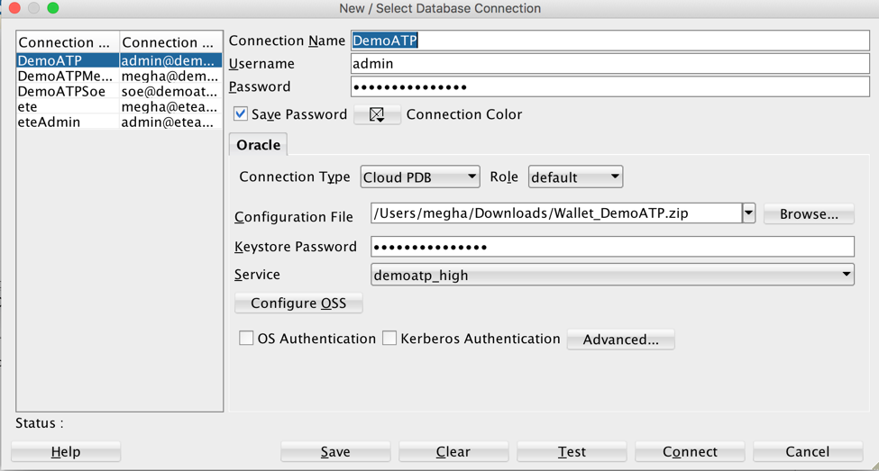

# Exporting from tables in Autonomous Database to text file in Object Storage

## Objectives
	
In this lab we will be exporting data from AUtonomous Database to a text file in object storage. 
This script demonstrates the use of threads with cx_Oracle. A session pool is used so that multiple connections are available to perform work on the database. 
Only one operation (such as an execute or fetch) can take place at a time on a connection. 
In the below example, one of the threads performs dbms_lock.sleep while the other performs a query. 

## Required Artifacts

- The following lab requires an Oracle Public Cloud account with Autonomous Data Warehouse Cloud Service.

- You need to have a connection to database in SQL Developer through admin. 

    - Open up your SQL Developer and create a new connection for admin. If you already have a connection, skip this step. 

    - Enter the following details for admin:

        1.	Connection Name: DemoATP
        2.	Username: admin
        3.	Password: Password you entered while creating database on cloud.
        4.	Connection Type: Cloud PDB
        5.	Configuration File: Path to your wallet
        6.	Keystore Password: Password entered while downloading wallet. 

        

    - Click on Test, if it shows success, click on save and then click on connect. 
 
 - This script requires cx_Oracle 2.5 and higher.
 
### **Step 1**: Download the Script

- Clone the script to your desktop. [PythonExportThreadADWC.py](PythonExportThreadADWC.py)

### **Step 2**: Configure your environment.

- Change the following parameters in this part of the script:

  **pool = cx_Oracle.SessionPool("Username", "Password","Service_Name", 2, 5, 1, threaded = True)**
  
  1. Username: your username
  2. Password: Password you entered while creating database on cloud.
  3. Service_Name : Your Service Name

- Change the following parameters in this part of the script:

  **for c in (select * from table_name WHERE ROWNUM <= 10)**
  
  **loop**
    
    **utl_file.put_line(p_file, c.column_name );**
  
  1. **table_name** : Your Table name
  2. **column_name** : Your Column name
 
- Change the following parameter in this part of the script:

  **dbms_cloud.put_object(**
  	 **'OBJ_STORE_CRED',** 
	 **'swift URL to Object Storage/test_file.txt',**
	 **'DATA_PUMP_DIR',**
	 **'test_file.txt' );**
  
  
  1. **OBJ_STORE_CRED**: Name of the credential that you have created in your Autonomous Environment. 
  2. **swift URL to Object Storage**: Change this to swift URL of your Object Storage
  
 - Now run the script. Navigate to your object storage and you should see test_file.txt file with all your data.

  
